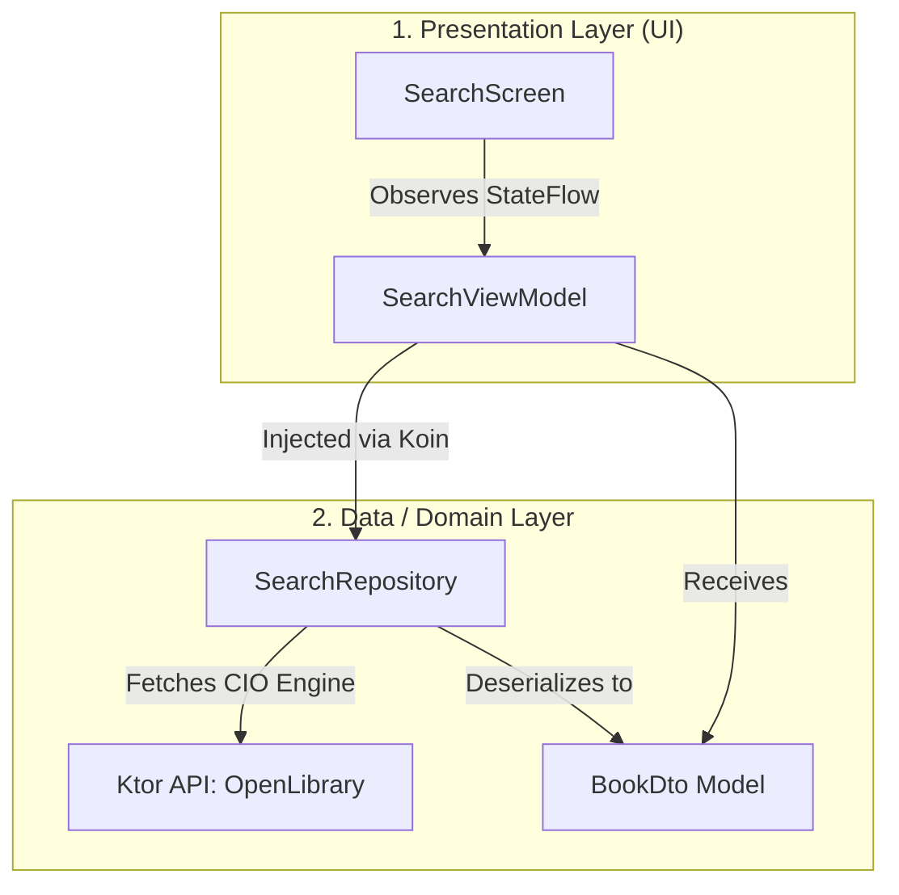
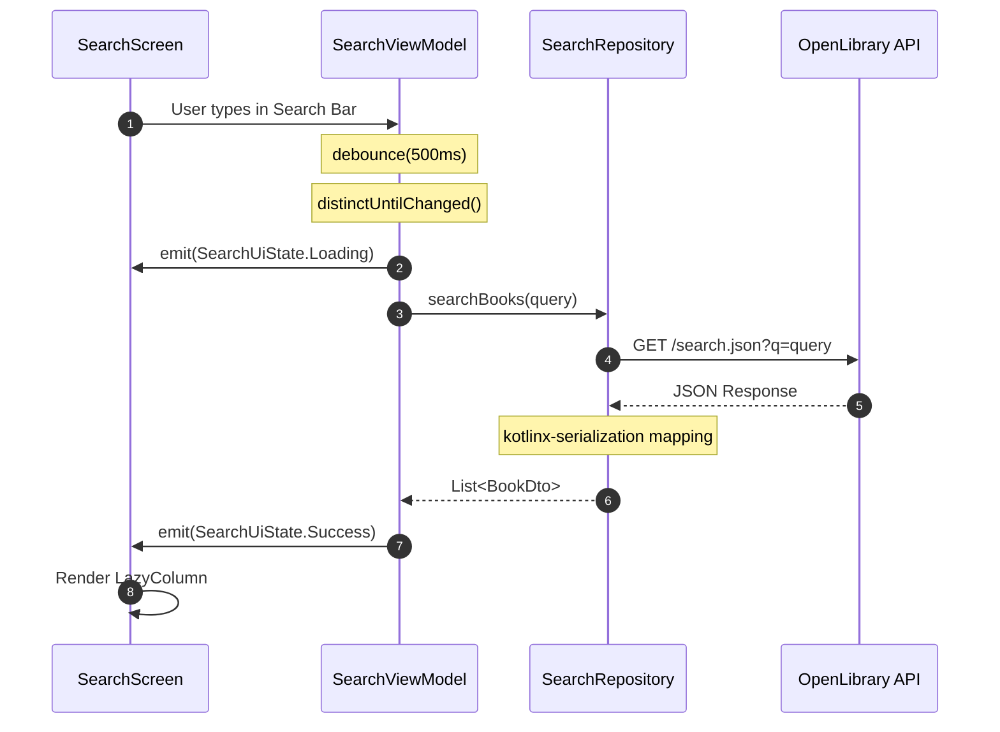
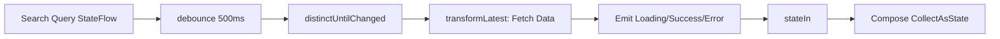

# High-Level Architecture Diagrams

This document visualizes the modern Architecture implemented in this project, designed as a robust template for scalable Android applications.

## 1. Overall System Architecture (Koin + Ktor)

The project utilizes a straightforward architecture prioritizing reactive state management and clean separation between the presentation and data layers.

### Key Architectural Decisions:
- **Reactive Flow**: The ViewModel connects to the UI via `StateFlow` and handles complex timing operations (like debounce) out of the box using coroutines.
- **Data Isolation**: The UI observes a tightly controlled `SearchUiState` while interacting purely through intent functions (`onQueryChanged`).
- **Dependency Injection**: Koin is utilized over Hilt/Dagger. Koin provides the `HttpClient` to the `SearchRepository`, and the `SearchRepository` to the `SearchViewModel` through a simple Kotlin DSL module, avoiding heavy annotation processing.
- **Ktor Networking**: Ktor replaces Retrofit. This ensures the entire networking and serialization (`kotlinx-serialization`) stack is pure Kotlin, meaning it can easily be migrated to Kotlin Multiplatform (KMP) in the future.

---

## 2. Reactive Search Flow

This diagram illustrates how user input is processed, debounced, and used to fetch data synchronously, managing UI states along the way.

---

## 3. UI State Pipeline (ViewModel)

The UI state is deterministically generated from user input using a reactive Kotlin Flow pipeline in the ViewModel.

