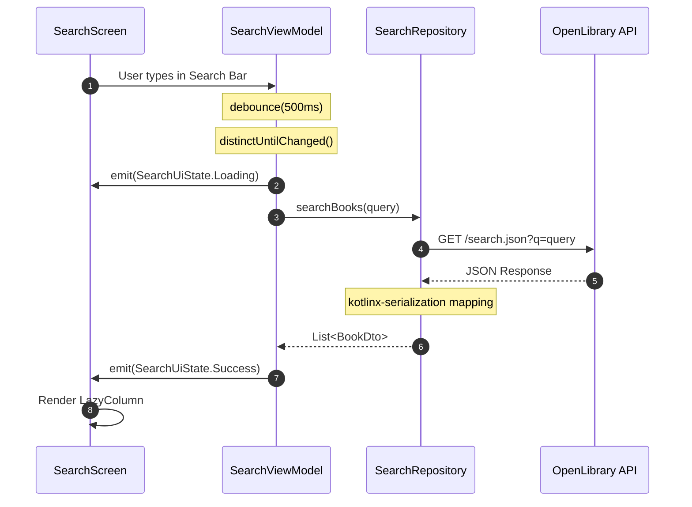
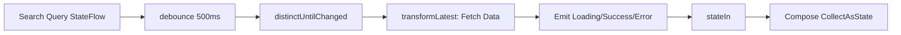

# Android Clean Architecture Template (2026 Edition)

This project serves as a production-ready, highly robust template demonstrating modern Android architecture. It is designed to be an excellent reference for system design interviews and scalable app development.

## 🏗️ Architecture Overview

This project implements **Clean Architecture** with a streamlined search feature integration. 

### Core Layers:

1.  **Presentation (UI) Layer**
    - Built entirely with **Jetpack Compose**.
    - **ViewModel** manages state using `StateFlow` and handles user intents.
    - Reactive pipelines handle debouncing (e.g., waiting 500ms before triggering a search).

2.  **Domain/Feature Layer**
    - **Models**: Pure data classes (`BookDto`, `SearchResponse`).
    - **Repositories**: Manages data operations (`SearchRepository`).

3.  **Data Layer**
    - **Remote Source**: Ktor Client.
    - **Mappers/Serialization**: Handled implicitly by `kotlinx-serialization` allowing safe data transformation before hitting the UI.

## 🛠️ Modern Tech Stack (March 2026)

- **Language**: Kotlin 2.1.0 (K2 Compiler)
- **UI**: Jetpack Compose (BOM 2026.02.01)
- **Dependency Injection**: Koin 3.5.3
- **Asynchronous Flow**: Kotlin Coroutines & Flow
- **Network**: Ktor 2.3.8 + Kotlinx Serialization
- **Build System**: Gradle 8.13.2 Version Catalogs (`libs.versions.toml`)

## 💡 Key Architectural Patterns to Mention in Interviews:

1.  **Dependency Injection**: Use of Koin allows for lightweight, concise dependency graphs constructed purely via Kotlin DSL without the overhead of annotation processing (KAPT/KSP).
2.  **Reactive State Management**: The ViewModel implements a robust debounced search pipeline, ensuring network calls are only executed when user input settles, optimizing resource usage.
3.  **Cross-Platform Ready Network Stack**: Utilizing Ktor over Retrofit makes the networking layer easily portable to Kotlin Multiplatform (KMP) if the project needs to scale to iOS or Desktop.

## 🚀 How to Run
1. Open the project in Android Studio.
2. Wait for Gradle Sync (ensure you are using Java 17+).
3. Run on an Emulator or Physical Device.

---

# Architecture Diagrams

## 1. Overall System Architecture (Clean Architecture + Koin)

```mermaid
graph TD
    subgraph Presentation_Layer ["1. Presentation Layer (UI)"]
        UI[SearchScreen]
        VM[SearchViewModel]
    end

    subgraph Data_Layer ["2. Data / Domain Layer"]
        RepoImpl[SearchRepository]
        API[Ktor API: OpenLibrary]
        Model[BookDto Model]
    end

    %% Dependency Rules (Inwards)
    UI -->|Observes StateFlow| VM
    VM -->|Injected via Koin| RepoImpl
    
    %% Data Flow
    RepoImpl -->|Fetches (CIO Engine)| API
    RepoImpl -->|Deserializes to| Model
    VM -->|Receives| Model
```

## 2. Reactive Search Flow



## 3. UI State Pipeline (ViewModel)


