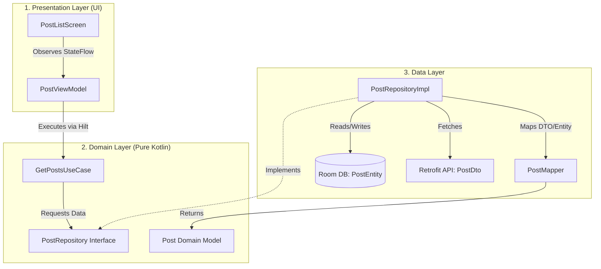
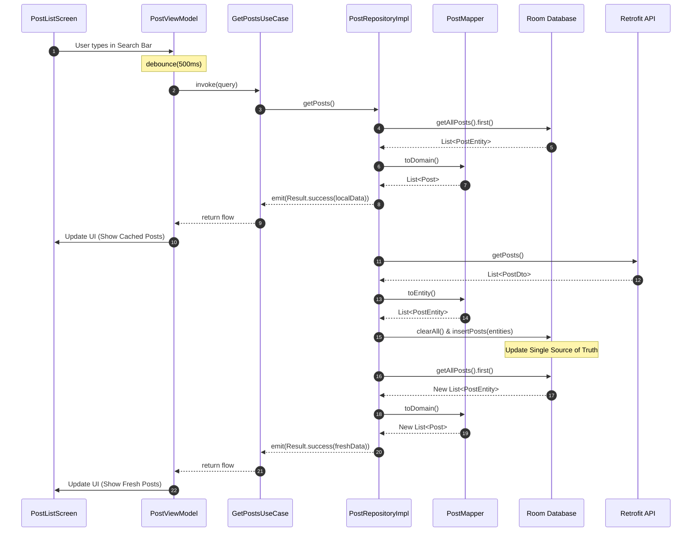
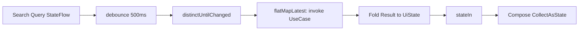

# Android Clean Architecture Template (2026 Edition)

This project serves as a production-ready, highly robust template demonstrating modern Android architecture. It is designed to be an excellent reference for system design interviews and scalable app development.

## 🏗️ Architecture Overview

This project implements **Clean Architecture** coupled with an **Offline-First (Single Source of Truth)** strategy. 

### Core Layers:

1.  **Presentation (UI) Layer**
    - Built entirely with **Jetpack Compose**.
    - **ViewModel** manages state using `StateFlow` and handles user intents.
    - Reactive pipelines handle debouncing (e.g., waiting 500ms before triggering a search).

2.  **Domain Layer (The Core)**
    - Completely agnostic of the Android framework.
    - **Models**: Pure data classes (`Post`).
    - **Repositories**: Interfaces defining data operations (`PostRepository`).
    - **Use Cases**: Encapsulate specific business rules (`GetPostsUseCase`).

3.  **Data Layer**
    - **Repository Implementation**: Implements the Domain interface.
    - **Local Source**: Room Database (`PostEntity`). Acts as the Single Source of Truth.
    - **Remote Source**: Retrofit (`PostDto`).
    - **Mappers**: Isolate framework models from the domain. Data is mapped from `DTO -> Entity -> Domain Model` before reaching the UI.

## 🛠️ Modern Tech Stack (March 2026)

- **Language**: Kotlin 2.1.0 (K2 Compiler)
- **UI**: Jetpack Compose (BOM 2026.02.01)
- **Dependency Injection**: Dagger Hilt
- **Asynchronous Flow**: Kotlin Coroutines & Flow
- **Local Database**: Room 2.7.x (using KSP instead of deprecated kapt)
- **Network**: Retrofit 2.11.0 + Gson
- **Build System**: Gradle 8.13.2 Version Catalogs (`libs.versions.toml`)

## 💡 Key Architectural Patterns to Mention in Interviews:

1.  **Dependency Inversion**: The Data layer depends on the Domain layer via interfaces, not the other way around. This makes the Domain layer easily testable and decoupled from APIs or DBs.
2.  **Single Source of Truth (SSOT)**: The ViewModel only ever receives data that originated from the local Room database. The network's only job is to update the database.
3.  **Anti-Corruption Layer (Mappers)**: We never leak JSON models (`PostDto`) or Database models (`PostEntity`) into the UI. If the API changes, only the Mapper needs to change; the UI is completely unaffected.
4.  **KSP vs KAPT**: Migrating to Kotlin Symbol Processing (KSP) significantly improves build times compared to the legacy `kapt` Java stub generation.

## 🚀 How to Run
1. Open the project in Android Studio.
2. Wait for Gradle Sync (ensure you are using Java 17+ or 21).
3. Run on an Emulator or Physical Device.

---

# Architecture Diagrams

## 1. Overall System Architecture (Clean Architecture + Hilt)

## 2. Offline-First "Single Source of Truth" Flow

## 3. UI State Pipeline (ViewModel)

